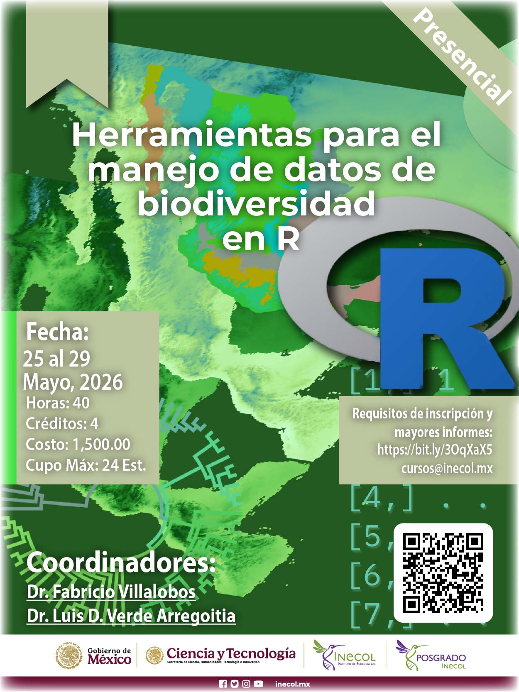

Página oficial con todos los recursos (materiales prácticos y presentaciones) para todos los temas. El material será actualizado al finalizar el curso para resolver errores o dudas.

::: columns
::: {.column width="40%"}
{width="90%"}
:::

::: {.column width="60%"}

### Coordinan
Dr. Luis D. Verde Arregoitia  
Dr. Fabricio Villalobos Camacho

## Imparten

Dr. Luis D. Verde Arregoitia  
Dr. Fabricio Villalobos Camacho  
M. en C. Gerardo Dirzo Uribe  
M. en C. Diana Ochoa Sanz

📆 &ensp; 25-29 de mayo, 2026\
⏰ &ensp;09:00 - 17:00\
🏨 &ensp;Aula 2 (planta baja), Edificio E, Campus I\

:::
:::

